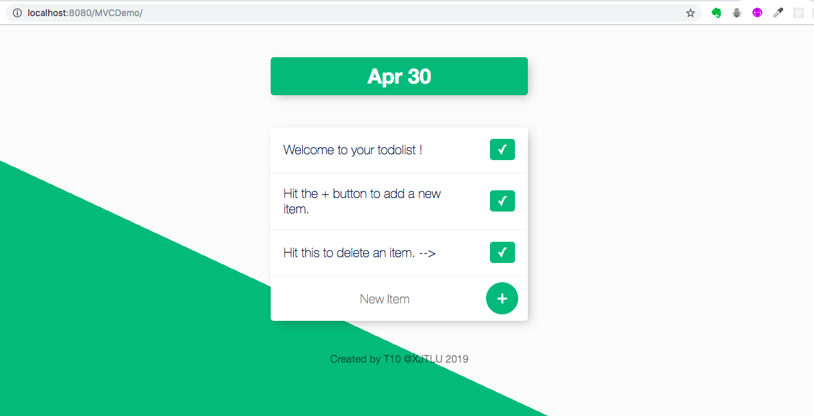

# CSE406-T10
Assignment3 (Team 10 Demo)



## How to clone file to Eclipse

Step 1: Download Zip from github

Step 2: Open Eclipse, create a new project.

Step 3: Choose "General/Project" --> next --> add a Project Name --> Finish

Step 4: Right check the new project --> Import --> File System --> choose the file you have downloaded --> Select All -->Finish

Step 5: Open 'src/com.mvc.servlet/TodoListServlet.java' --> Run on Server

## Create Datebase
Between Step 4 and 5, you will need to create your datebase in MySQL Workbench

Here is the SQL code:

```bash

  CREATE TABLE todos(id INT PRIMARY KEY AUTO_INCREMENT,item varchar(50));

  select * from todos;

  INSERT INTO todos VALUES(0,"Welcome to your todolist !");
  INSERT INTO todos VALUES(0,"Hit the + button to aff a new item.");
  INSERT INTO todos VALUES(0,"Hit this to delete an item. -->");
  ```
  Modify the DB_URL, USER, and PASS in file 'src/com.mvc.todo/TodoDAODB.java'
  
  After that, this java app will be connected to your Datebase.
